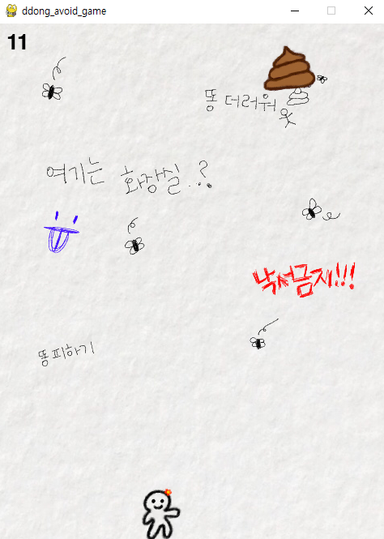
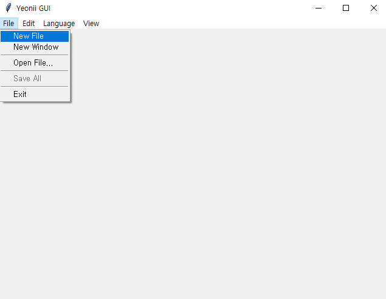
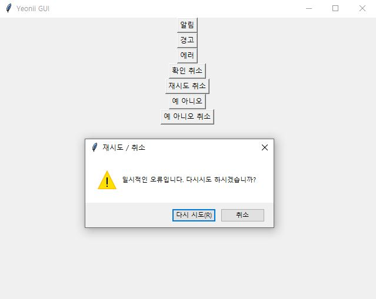
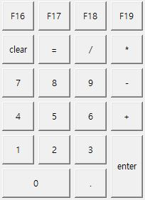
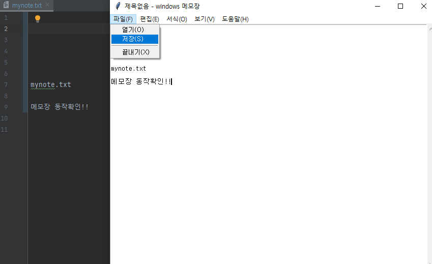
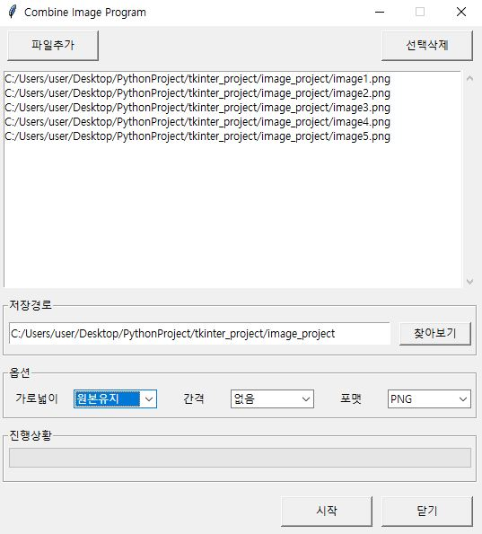

# ⚽ Python TIL⚽

🏈 python의 라이브러리를 이용하여 다양한 프로젝트를 진행해본다.<br>
🏈 2021.05.01 ~ 진행 중<br>

## 🏐 목차 <br>

```shell
- beautifulsoup, requests <scrapping(crawling) project>
- pygame <게임 개발 project>
- pygame 기초 (character, enemy간 충돌 발생 시 게임 종료)
```

## 1. crawling

<details>
  <summary><b>새글 카톡알람 서비스</b></summary><br>

> crawling/crawling.py

> <b>2021.05.21 (完)</b>

beautifulsoup와 requests를 이용한 크롤링에 대하여 학습하였다.<br>한국외국어대학교 소프트웨어 중심대학 사이트 구조를 분석하여 공지사항이 올라올 때 카카오톡 api를 이용하여 내용을 전송 받을 수
있도록 설정하였다.
</details><br>

## 2. pygame<br>

> pygame 라이브러리를 이용한 학습은 유튜브 '나도코딩'님 강좌를 참고하였습니다.<br>

<details>
  <summary><b>pygame을 이용한 간단한 게임</b></summary><br>

> pygame basic/7_text.py

> <b>2021.05.23 (完)</b>

pygame을 이용하여 character와 enemy가 서로 충돌할 경우 2초 delay -> 게임 종료 하도록 하는 프로젝트를 진행하였다.<br>
추가로 timer도 세팅하여 화면 좌측 상단에 10초 타이머를 표시하였다.(time out일 때 게임 종료)<br>
pygame을 이용한 게임 개발 시 기본 틀은 <code>pygame_basic/8_fram.py</code>와 같다.
<br>
</details><br>

<details>
  <summary><b>똥피하기 게임</b></summary><br>

> pygame_homework/ddong_avoid_game.py

> <b>2021.05.24 (完)</b>

위에서 배운 pygame 기초 개념 및 기본 틀을 이용하여, 실제 게임을 제작해보았다.<br>
게임은 똥피하기 게임으로, 똥과 캐릭터가 충돌하는 경우 게임은 종료된다. 좌측 상단에 게임이 진행된 시간을 초 단위로 표시한다.<br>
모든 이미지는 직접 그려 사용하였으며(저작권 본인_heeeon), 실습 내용은 아래와 같다.

  <p align="center"></p>
  <br>
</details>

<details open>
  <summary><b>풍선 쪼개기 게임</b></summary><br>

> pygame_project/split_balloon_game.py

> <b>2021.05.24 - 2021.05.27 (完)</b>

풍선 쪼개기 프로젝트를 진행하였다. 풍선은 각각 1~4레벨이 있으며 1레벨의 풍선을 터트리면 다음 레벨로 쪼개진다. 4레벨 풍선을 터트린 경우, 풍선은 사라진다.
<br>life는 3회로 지정되어있고, game over 조건은 아래의 3가지가 있다.

  ```shell
  1. 풍선을 모두 터트린 경우(성공) - Mission Complete 문구가 뜬 후 2초 뒤 게임 종료
  2. 풍선에 3회 이상 맞은 경우(실패) - Game Over 문구가 뜬 후 2초 뒤 게임 종료
  3. 100초 안에 Clear하지 못한 경우(실패) - Time Over 문구가 뜬 후 2초 뒤 게임 종료
  ```

모든 이미지는 직접 그려 사용하였으며(저작권 본인_heeeon), 실습 내용은 아래와 같다.
  <p align="center"></p>
<br>

</details><br>

## 3. tkinter<br>

<code>tkinter</code>은 python 설치시 기본으로 내장되어있는 표준 GUI(Graphical User Interface) 라이브러리이다(BUT 유일한 GUI Programming toolkit은
아님). 이는 TCI/TK 위 얇은 객체 지향 레이어 이다.

> tkinter 라이브러리를 이용한 실습은 유튜브 '나도코딩'님 강좌를 참고하였습니다.<br>

<details>
  <summary><b>tkinter basic</b></summary><br>

> tkinter_project/tkinter_basic
> 2021.06.08 - 2021.06.10 (完)

tkinter 라이브러리 기본 사용 방법에 대하여 학습한다. 아래 내용에 대하여 차례대로 실습을 진행하며, 기본 개념을 이해한다.

- 기본 창 생성
- button
- label
- text entry
- list box
- checkbox, radio button, combo box
- progress bar
- menu
- message box
- frame
- scroll bar
- grid

실습 예) 메뉴 창 만들어보기<br>
  <p align="center"></p>
  <br>
  실습 예) message box의 여러 속성 이용하기<br>
  <p align="center"></p>
  <br>
  실습 예) grid로 버튼을 배치하여 키패드 만들기<br>

  <p align="center"></p>
  <br>
</details>

<details>
  <summary><b>memo project</b></summary><br>

> tkinter_project/memo_project/memo.py
> 2021.06.15 (完)

windows 메모장과 동일한 창을 구현해본다. 실습 조건은 다음과 같다.

  ```text
  메뉴 바는 파일(F), 편집(E), 서식(O), 보기(V), 도움말(H)로 구성된다.
  이때 실제 동작은 파일의 3가지 항목(열기, 저장, 끝내기)에 대해서만 처리한다.
  text box 우측에 scroll bar를 함께 배치한다.
  ```

실제 구현 내용은 아래 그림에서 확인할 수 있다.
  <p align="center"></p>
  <br>
</details>

<details>
  <summary><b>combine image project</b></summary><br>

> tkinter_project/image_project/comb_image.py

> tkinter_project/image_project/auto_screenshot.py

> 2021.06.16 - 2021.06.18 (完)

여러장의 이미지를 하나로 합쳐주는 프로그램을 제작한다. 동작 예시는 아래와 같다.<br>

  ```text
  <Scenario description>
  
  1. 사용자는 합치려는 이미지를 1개 이상 선택한다.
  2. 합쳐진 이미지가 저장될 경로를 지정한다.
  3. 가로넓이(원본유지, 1024, 800, 640), 간격(없음, 좁게, 보통, 넓게), 포맷(PNG, JPG, BMP) 옵션을 지정한다.
  4. 시작 버튼을 통해 이미지를 합친다.
  5. 닫기 버튼을 통해 프로그램을 종료한다.
  ```
<br>
프로그램을 실행시켜볼 이미지는 동영상에서 추출하여 사용한다. 이때 이미지 추출을 위한 auto screenshot 기능을 코드로 작성해 본다. 이를 구현하기 위해서 Pillow 패키지를 설치하였다.
<br>

  ```shell
  $ pip install Pillow
  ```
<br>
아래 함수를 사용하여 이미지 스크린샷, 저장이 가능하다.<br>

  ```python
  from PIL import ImageGrab

  img = ImageGrab.grab()  # 현재 스크린의 이미지를 가져옴
  img.save("image1.png")  # image1.png 파일로 저장
  ```
<br><br>
+) python 문법 zip, unzip<br>

  ```python
  # zip -> 두 리스트를 수직으로 합쳐줌
  kor = ["사과", "바나나", "오렌지"]
  eng = ["apple", "banana", "orange"]

  print(list(zip(kor, eng)))  # [('사과', 'apple'), ('바나나', 'banana'), ('오렌지', 'orange')]

  # -----------------------------------------------------------------------
  
  # unzip 하나의 리스트를 분리해줌
  mixed = [('사과', 'apple'), ('바나나', 'banana'), ('오렌지', 'orange')]

  # kor2 = [x[0] for x in mixed]
  # eng2 = [x[1] for x in mixed] 를 아래 한줄로 표현 가능
  kor2, eng2 = zip(*mixed)

  print(kor2)  # ("사과", "바나나", "오렌지")
  print(eng2)  # ("apple", "banana", "orange")
  ```
  <br>
  실습 결과는 아래 그림과 같다.<br>
  <p align="center"></p>
  <br>
</details>